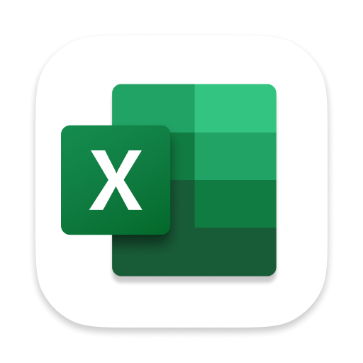
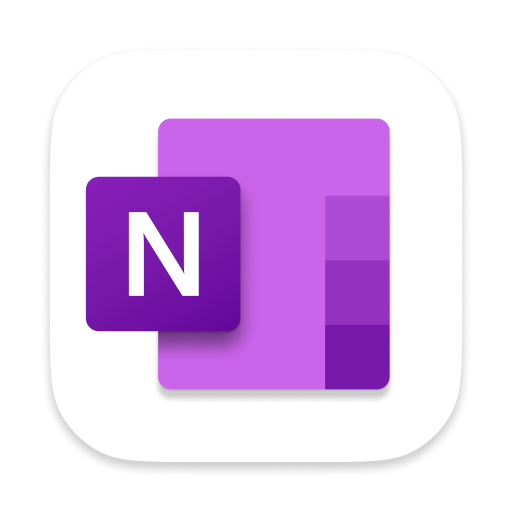

# **MOFA**
**M**icrosoft **O**ffice **F**eed for **A**pple

Welcome to the **MOFA** repository! This centralized and up-to-date resource offers Microsoft Office downloads for macOS, data feeds, along with comprehensive support documentation for Mac administrators. It aims to replace the now-defunct [**MacAdmins.software**](https://macadmins.software), and we would like to extend a special thanks to [**Paul Bowden**](https://github.com/pbowden-msft) for his exceptional contributions to the Mac Admins community.

We encourage active community participation—feel free to fork the repository, ask questions, or contribute additional insights to ensure its ongoing accuracy and usefulness. Together, we can keep this resource thriving for everyone.

### **Current Focus Areas**  

- **✅ Feature/Improvement:** Automated `latest.xml` (Checks every 4 hours with Microsoft sources) – *Completed!*  
- **✅ Feature/Improvement:** Automating workflow to update `README.md` – *Completed!* 
- **🔄 Feature/Improvement:** Adding more links/documentation – *In Progress*
- **🚀 Future:** Add iOS/MacOS AppStore Info – *Upcoming*
- **🚀 Future:** Migrate to a full webpage – *Waiting on funding/support 💸*

I’m not here to make a profit—just here to ensure knowledge remains open and free for all, check the button below to support MOFA:

  

## </a> Microsoft Office Installers

All links below direct to Microsoft's official Content Delivery Network (CDN).
The links provided will always download the latest version offered by Microsoft. However, the version information listed below reflects the version available at the time of this update.

_Last Updated: <code style="color : mediumseagreen">December 09, 2024 03:13 PM EST</code> [**_Raw XML_**](/latest.xml) [**_Raw YAML_**](/latest.yaml) (Automatically Updated every 4 hours)_

| **Product Package** | **CFBundle Version** | **CFBundle Identifier** | **Download** |
|----------------------|----------------------|--------------------------|--------------|
| **Microsoft** 365/2021/2024 **Office Suite Installer** <a href="https://learn.microsoft.com/en-us/officeupdates/release-notes-office-for-mac" style="text-decoration: none;"><small>_Release Notes_</small></a> _(Includes Word, Excel, PowerPoint, Outlook, OneNote, OneDrive, and MAU)_ | `16.91.0 (24111020)` | com.microsoft.office |  |
| **Microsoft** 365/2021/2024 **BusinessPro Suite Installer** _(Includes Word, Excel, PowerPoint, Outlook, OneNote, OneDrive, Teams, Defender Shim, and MAU)_ | `16.91.0 (24111020)` | com.microsoft.office |  |
| **Word** 365/2021/2024 ** Standalone Installer** | `16.91.0 (24111020)` | com.microsoft.word |  |
| **Excel** 365/2021/2024 **Standalone Installer** | `16.91.0 (24111020)` | com.microsoft.excel |  |
| **PowerPoint** 365/2021/2024 **Standalone Installer** | `16.91.0 (24111020)` | com.microsoft.powerpoint |  |
| **Outlook** 365/2021/2024 **Standalone Installer** | `16.91.1 (24111613)` | com.microsoft.outlook | |
| **OneNote** 365/2021/2024 **Standalone Installer** | `16.91.1 (24111613)` | com.microsoft.onenote.mac |  |
| **OneDrive Standalone Installer** <a href="https://support.microsoft.com/en-us/office/onedrive-release-notes-845dcf18-f921-435e-bf28-4e24b95e5fc0#OSVersion=Mac" style="text-decoration: none;"><small>_Release Notes_</small></a> | `24.221.1103` | com.microsoft.OneDrive |  |
| **Skype for Business Standalone Installer** <a href="https://support.microsoft.com/en-us/office/follow-the-latest-updates-in-skype-for-business-cece9f93-add1-4d93-9a38-56cc598e5781?ui=en-us&rs=en-us&ad=us" style="text-decoration: none;"><small>_Release Notes_</small></a>  | `16.31.11` | com.microsoft.SkypeForBusiness |  |
| **Teams Standalone Installer** <a href="https://support.microsoft.com/en-us/office/what-s-new-in-microsoft-teams-d7092a6d-c896-424c-b362-a472d5f105de" style="text-decoration: none;"><small>_Release Notes_</small></a>  | `24295.606.3238.6194` | com.microsoft.teams2 |  |
| **InTune Company Portal Standalone Installer** <a href="https://aka.ms/intuneupdates" style="text-decoration: none;"><small>_Release Notes_</small></a> | `5.2410.1` | com.microsoft.CompanyPortalMac |  |
| **Edge Standalone Installer** _(Stable Channel)_ <a href="https://learn.microsoft.com/en-us/deployedge/microsoft-edge-relnote-stable-channel" style="text-decoration: none;"><small>_Release Notes_</small></a>| `131.0.2903.86` | com.microsoft.edgemac | |
| **Defender for Endpoint Installer** <a href="https://learn.microsoft.com/microsoft-365/security/defender-endpoint/mac-whatsnew" style="text-decoration: none;"><small>_Release Notes_</small></a> | `101.24092.0004` | com.microsoft.wdav |  |
| **Defender for Consumers Installer** <a href="https://learn.microsoft.com/microsoft-365/security/defender-endpoint/mac-whatsnew" style="text-decoration: none;"><small>_Release Notes_</small></a> | `101.24092.0004` | com.microsoft.wdav |  |
| **Defender SHIM Installer** | `101.24080.0001` | com.microsoft.wdav.shim |  |
| **Windows App Standalone Installer** </a>_(Remote Desktop </a>)_ <a href="https://learn.microsoft.com/en-us/windows-app/whats-new?tabs=macos" style="text-decoration: none;"><small>_Release Notes_</small> | `11.0.7` | com.microsoft.rdc.macos |  |
| **Visual Studio Code Standalone Installer** <a href="https://code.visualstudio.com/updates/" style="text-decoration: none;"><small>_Release Notes_</small></a>  | `1.95.3` | com.microsoft.VSCode | |
| **AutoUpdate Standalone Installer** <a href="https://learn.microsoft.com/en-us/officeupdates/release-history-microsoft-autoupdate" style="text-decoration: none;"><small>_Release Notes_</small></a>  | `4.76 (24101387)` | com.microsoft.autoupdate | |
| **Licensing Helper Tool Installer** | `16.77.0 (23091003)` | N/A | |
| **Quick Assist Installer** | `1.0.2411113` | com.microsoft.quickassist | |
| **Remote Help Installer** | `1.0.2411113` | com.microsoft.remotehelp | |

_**For items without specific release notes, please refer to the release notes for the entire suite.**_  

_**All apps include MAU with installation, except for Skype for Business, OneDrive, Defender SHIM, Licensing Helper Tool, Quick Assist, and Remote Help.**_

| **Product Package** | **Link** | **SHA256 Hash** |
|----------------------|----------|------------------|
| **Microsoft** 365/2021/2024 **and Office Suite Installer** _(Includes Word, Excel, PowerPoint, Outlook, OneNote, OneDrive, and MAU)_ |  | `86bb9dc49bcc0d8b632d37ad6743b15a4c2caaa1b8a76029167a720d356a884d` |
| **Microsoft** 365/2021/2024 **BusinessPro Suite Installer** _(Includes Word, Excel, PowerPoint, Outlook, OneNote, OneDrive, Teams, Defender Shim, and MAU)_ |  | `40d9cc4355fc1e3bb3c7d214ddcb3d5c87503030bf3ad8cad87df8f32b3c1d5d` |
| **Word** 365/2021/2024 **Standalone Installer** |  | `7fab22d0a3304d2bd1fc9019c7e0481c637e44892e20500de72244feef191e9e` |
| **Excel** 365/2021/2024 **Standalone Installer** |  | `30f65ea8b0c591e53ad6e22e0fff5de3e09197ddbef3729bb96fee6a2655d8de` |
| **PowerPoint** 365/2021/2024 **Standalone Installer** |  | `1b2bac9fd9981bcd6729c737f5946b540fabac75c1a5946b1a32901304a0c20f` |
| **Outlook** 365/2021/2024 **Standalone Installer**|  | `ca1ddefe1b437437d5d870ce919cb509031564cbe7aa0b792af7705d4599fb8c` |
| **OneNote** 365/2021/2024 **Standalone Installer** |  | `d06ed77926075074c53e63b64534d4c6d0812cfb83b267412ee66350a980f5b5` |
| **OneDrive Standalone Installer** |  | `eb51bce31b686281692a7aeacd8c0f017e9ba17f686cce989b125505be48028e` |
| **Skype for Business Standalone Installer** |  | `81f484842e86a39c9f33abc4d35b4e7dbb87189ca3c424a6396e15d96ea2dbd5` |
| **Teams Standalone Installer** |  | `fccf2c82a08f23ba424147c2753e82e72a24d78146d10a50f6e035e37b0a4f9b` |
| **InTune Company Portal Standalone Installer** |  | `2ef8a0fe0e4bd03abb689262554efc555d0edc39d9bb39fd8fe268bbaf459751` |
| **Edge Standalone Installer** _(Stable Channel)_ |  | `77dc0bf6d465815d3414a1b52d506323619c9debb12f9feb85ec4ad2c7e58585` |
| **Defender For Endpoint Installer** |  | `1c2afefa61b76d203cd5183c2f019e8345cf2b299b6179a9df483e5ed57bac5f` |
| **Defender For Consumer Installer** |  | `957e6ed878f595347d759bbeda9e0edebbbe904b8b8858216d6db03c0faec1bf` |
| **Defender Shim Installer** |  | `3c455357808b67ec0ebbed62825e5d7f4652f3f53a1d3d58510e82099981bb51` |
| **Windows App Standalone Installer** |  | `9e4fbd4d82cbede7a26d442267e660ea68245733ce5ac9717d694346bc09fef3` |
| **Visual Studio Code Standalone Installer** |  | `2b7788d17d2e0f3ac1fc684b126fa3739403fd2cdcd97e92ddcb738619f04aa9` |
| **AutoUpdate Standalone Installer** |  | `91fed0b500d85daf6e453bb7b2bee2948973781475c118c03c837e819a290fcc` |
| **Licensing Helper Tool Installer** |  | `2ef5b5006534c0d20d46c7353f42a0dc1faff7d53ba89a3151ccf5102c059905` |
| **Quick Assist Installer** |  | `2fdab5e1815862c9b3583257c485b088aa46c86e5609cad09bfa13a3a092a0e1` |
| **Remote Help Installer** |  | `0fb298a8cbf6d58a9846b639e1b8581085993f184fbc823448ef5d6bbb4467b6` |

_[**How to Get the SHA256 Guide**](/guides/How_To_SHA256.md)_

| **Special Product Package** | **CFBundle Version** | **MAU Status** | **Download** |
|----------------------|----------------------|--------------------------|--------------|
| **Word** 365/2021/2024 ** Standalone Installer** | `16.91.0 (24111020)` | No MAU |  |
| **Excel** 365/2021/2024 **Standalone Installer** | `16.91.0 (24111020)` | No MAU |  |
| **PowerPoint** 365/2021/2024 **Standalone Installer** | `16.91.0 (24111020)` | No MAU |  |
| **Outlook** 365/2021/2024 **Standalone Installer**_(Weekly Channel)_| `16.91.1 (24111613)` | No MAU | |
| **OneNote** 365/2021/2024 **Standalone Installer** | `16.91.1 (24111613)` | No MAU |  |
| **InTune Company Portal Standalone Installer** <a href="https://aka.ms/intuneupdates" style="text-decoration: none;"><small>_Release Notes_</small></a> | `5.2410.1` | No MAU |  |
| **Outlook** 365/2021/2024 **Standalone Installer**_(Monthly Channel)_| `N/A - Check Release Notes` | Contains MAU | |

|      Update History                   |          Microsoft Update Channels               |
|-------------------------|-------------------------|
|  [Microsoft 365/2021/2024](https://learn.microsoft.com/en-us/officeupdates/update-history-office-for-mac) |   [Microsoft 365 Apps](https://learn.microsoft.com/en-us/microsoft-365-apps/updates/overview-update-channels) |

## **</a> Microsoft Office Repair Tools </a>**

### ** [Office-Reset.com](https://office-reset.com/macadmins/)**
- A free tool to fix issues with Microsoft Office apps on macOS (e.g., crashes, performance problems). It offers various packages for resetting settings and clearing cache.
 **_ No Longer Updated/Maintained _**

### ** [Office-Reset Packages](/office_reset_pkgs/)**
- Archived copies of the original Office-Reset packages, now saved to this repository.
 **_ No Longer Updated/Maintained _**

### **</a> [Office Reset Scripts](/office_reset_scripts/) </a>**
- Fork and update these scripts from the original packages on office-reset.com.
 **_ Needs More Community Contributions _**

## ** Microsoft Scripts **

These scripts automate the process of downloading, installing, updating, and managing Microsoft products.

- **Download & Install Microsoft Products**: [View Script](https://gist.github.com/talkingmoose/b6637160b65b751824943ede022daa17) by [TalkingMoose](https://github.com/talkingmoose)  
  This script automates the downloading and installation of the latest Microsoft products using direct links and includes optional SHA256 verification for added security.

- **Install Office 365 Pro**: [View Script](https://github.com/microsoft/shell-intune-samples/blob/master/macOS/Apps/Office%20for%20Mac/installOffice365Pro.sh) by [Microsoft](https://github.com/microsoft)  
  This script automates the downloading and installation of the Office 365 Pro.

- **Installomator**: [View Script](https://github.com/Installomator/Installomator) by [Installomator](https://github.com/Installomator)  
  A powerful tool for automating the deployment of Microsoft Office products on macOS, simplifying downloading, installation, and updates.

- **Various Tools**: [View Scripts](https://github.com/pbowden-msft?tab=repositories) by [pbowden-msft](https://github.com/pbowden-msft)  
  A collection of tools for repairing, setting up, and automating Microsoft Office products.

## **Microsoft Office Preference Keys**

PLIST (Property List) files are used by macOS to store settings and preferences for apps, services, and system configurations, allowing Mac admins to:

- **Customize deployments**
- **Enforce policies**
- **Manage application behavior efficiently**

For a detailed guide on how to create and manage PLIST files, refer to the [How to Plist Guide](/guides/How_To_plist.md).

### **Recommended Resources:**

#### ** Mac Admin Community-Driven Preferences List (Highly Recommended!)**:
- [View Google Doc](https://docs.google.com/spreadsheets/d/1ESX5td0y0OP3jdzZ-C2SItm-TUi-iA_bcHCBvaoCumw/edit?gid=0#gid=0)

#### ** Official Microsoft Documentation:**

- [General PLIST Preferences](https://learn.microsoft.com/en-us/microsoft-365-apps/mac/deploy-preferences-for-office-for-mac)  
- [App-Specific Preferences](https://learn.microsoft.com/en-us/microsoft-365-apps/mac/set-preference-per-app)  
- [Outlook Preferences](https://learn.microsoft.com/en-us/microsoft-365-apps/mac/preferences-outlook)  
- [Office Suite Preferences](https://learn.microsoft.com/en-us/microsoft-365-apps/mac/preferences-office)

## **Contributing and Providing Feedback**

We warmly welcome your contributions and feedback to **macadmins_msft**! Here’s how you can get involved:

### 📋 **Report Issues**  
Have a bug to report or a feature to request? Submit an issue on our [GitHub Issues page](https://github.com/cocopuff2u/macadmins_msft/issues).  

### 💬 **Join the Discussion**  
Connect and collaborate in the [GitHub Discussions](https://github.com/cocopuff2u/macadmins_msft/discussions) or the [Mac Admins Slack Channel](https://macadmins.slack.com/).  
- **Reach Out Directly:** Contact me on Slack at `cocopuff2u` for direct collaboration or questions.
- **New to Slack?** [Sign up here](https://join.slack.com/t/macadmins/shared_invite/zt-2tq3md5zr-jDtuUFHAFa8CIBwPhpFfFQ).  
- **Existing User?** [Sign in here](https://macadmins.slack.com/).  
- **Explore Slack Channels:**  
    - `#microsoft-office`  
    - `#microsoft-autoupdate`  
    - `#microsoft-intune`  
    - `#microsoft-windows-app`  
    - `#microsoft-office-365`  
    - `#microsoft-teams`  

### ✉️ **Contact via Email**  
For inquiries, reach out directly at [cocopuff2u@yahoo.com](mailto:cocopuff2u@yahoo.com).  

### 🛠️ **Contribute Directly**  
Fork the repository, make your changes, and submit a pull request—every contribution counts!  

### 💡 **Share Your Feedback**  
Help us improve! Share your ideas and suggestions in the [GitHub Discussions](https://github.com/cocopuff2u/macadmins_msft/discussions) or via email.

### 🌟 **Support the Project**  
Any contributions to this project go toward building a fully-featured URL for this site or are shared with the Mac Admins community to keep information accessible for everyone. If you’re feeling generous, you can also support the project by donating to my coffee fund. 

## **Helpful Links**

Below are a list of helpful links.
- **Microsoft Versioning Shenanigans**: [View Link](https://macmule.com/2018/09/24/microsoft-office-for-mac-changes-versioning-shenanigans/)
- **Microsoft Deployment Options**: [View Link](https://learn.microsoft.com/en-us/microsoft-365-apps/mac/deployment-options-for-office-for-mac)
- **Microsoft Deploy From App Store**: [View Link](https://learn.microsoft.com/en-us/microsoft-365-apps/mac/deploy-mac-app-store)
- **JAMF Technical Paper: Managing Microsoft Office**: [View Link](https://learn.jamf.com/en-US/bundle/technical-paper-microsoft-office-current/page/User_Experience_Configuration.html)

## **Trademarks**

- **Microsoft 365, Office 365, Excel, PowerPoint, Outlook, OneDrive, OneNote, Teams** are trademarks of Microsoft Corporation.
- **Mac** and **macOS** are trademarks of Apple Inc.
- Other names and brands may be claimed as the property of their respective owners.
